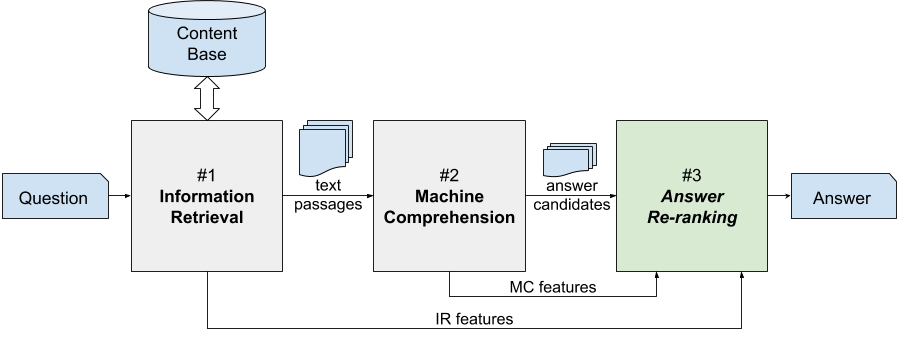

# RankQA: Neural Question Answering with Answer Re-Ranking
This is the PyTorch implementation of the ACL 2019 paper [RankQA: Neural Question Answering with Answer Re-Ranking](https://arxiv.org/abs/1906.03008)

<p align="center"></p>


The conventional paradigm in neural question answering (QA) for narrative content is limited to a two-stage process: first, relevant text passages are retrieved and, subsequently, a neural network for machine comprehension extracts the likeliest answer. However, both stages are largely isolated in the status quo and, hence, information from the two phases is never properly fused. In contrast, this work proposes RankQA: RankQA extends the conventional two-stage process in neural QA with a third stage that performs an additional answer re-ranking. The re-ranking leverages different features that are directly extracted from the QA pipeline, i.e., a combination of retrieval and comprehension features. While our intentionally simple design allows for an efficient, data-sparse estimation, it nevertheless outperforms more complex QA systems by a significant margin.

## Open Review and Changelog 

We want to support an open discourse about science and decided to publish our ACL 2019 reviews as well as a detailed list of changes that we have made ever since. In my free time, I am still trying to work on this project and you can find all updates and the reviews [HERE](history/README.md).

## Quick Overview

In our paper, we use two different QA pipelines. The main experiments are based on a customized DrQA system with additional answer re-ranking. In order to demonstrate robustness, we implemented a second pipeline based on BERT, which we call BERT-QA.

### RankQA: The Main Pipeline based on DrQA

We extended the [DrQA](https://github.com/facebookresearch/DrQA/) pipeline by integrating a third answer re-ranking module. In this repository, we split the answer re-ranking module from the rest of the pipeline in order to allow faster experiments. We precomputed and aggregated features for all candidate answers and you can read them directly from files.  

#### Feature Generation

If you want to extract features manually for new datasets please write us a mail and we will provide the source code. We will publish it here at a later point as well. You can find more information about pre-computed features for SQuAD, WebQuestions, WikiMovies, and CuratedTREC [HERE](rankqa/README.md). 

*NOTE*: To support future research in this area, our precomputed candidate answers contain tokenized paragraphs, questions and answer spans that can easily be processed by any neural network architecture.

#### Re-Ranking Module

A detailed description of our implementation, how to replicate the results, and the pre-trained model can be found [HERE](rankqa/README.md).

### Answer Re-Ranking Based on BERT-QA

To show robustness across implementations we implemented a second QA pipeline based on [BERT](https://github.com/google-research/bert). You can find the source code for BERT-QA [HERE](bertqa/README.md).

## Citation

Please cite our paper if you use RankQA in your work:

```
@inproceedings{kratzwald2019rankqa,
  title={RankQA: Neural Question Answering with Answer Re-Ranking},
  author={Kratzwald, Bernhard and Eigenmann, Anna and Feuerriegel, Stefan},
  booktitle={Annual Meeting of the Association for Computational Linguistics (ACL)},
  year={2019}
}
```

## Contact

Any questions left? 

Please write an email to `bkratzwald [AET] ethz [DOT] ch`
